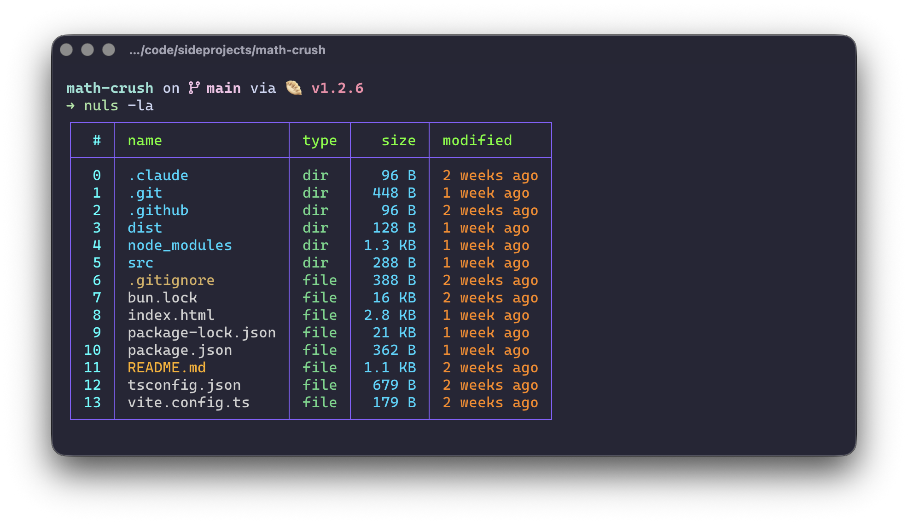

# nuls


<p align="center">
  
</p>


NuShell-inspired `ls` with a colorful, table-based layout: directory/file type tagging, human-readable sizes, relative “modified” times with recency-driven colors, and familiar flags.

## Features
- Box-drawn table with colored borders and headers
- Directory-first sorting by default; optional `-t/--sort-modified` (newest first) and `-r/--reverse`
- Relative modified column with recency-aware colors (seconds → years, plus future)
- Human-readable sizes (`KB`, `MB`, `GB`, `TB`)
- Hidden files toggled via `-a/--all`
- Colored help output for quick scanning

## Install
From crates.io:
```bash
cargo install nuls
```

Building locally:
```bash
cargo install --path . --bin nuls --force
# optional: cargo install --path . --bin nuls --force --root ~/.local
```

## Usage
```bash
# basic listing
nuls

# include hidden files
nuls -a

# sort by modified (newest first), reverse for oldest first
nuls -t
nuls -tr

# combine with hidden and long muscle-memory flag
nuls -la
```

## Flags
- `-a, --all` — show dotfiles
- `-l, --long` — accepted for familiarity (output is already long-form)
- `-t, --sort-modified` — sort by modified time (newest first)
- `-r, --reverse` — reverse sort order
- `--color=always/auto/never` — control ANSI color (default: auto; help is forced color)

## Palette
- Borders/header: teal/green highlights
- Names: dirs blue, files light gray, executables red, dotfiles amber, config/docs yellow
- Modified: green → yellow → orange → red → gray as timestamps get older; blue for future

## Notes
- Directories sort before files unless you use `-t` (modified), in which case recency wins.

## Aliases
Drop one of these in your shell config for muscle-memory:
```bash
# replace ls entirely
alias ls="nuls"

# or keep both
alias nls="nuls"

# with defaults you like
alias lst="nuls -t"
alias lsa="nuls -a"
alias lsat="nuls -at"
```
